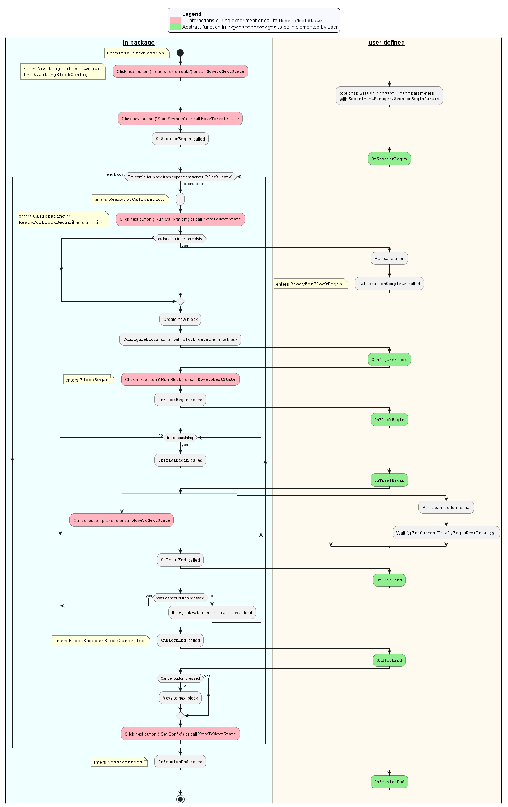

# UXF Extensions
A template for [UXF](https://github.com/immersivecognition/unity-experiment-framework) projects that uses [experiment server](https://github.com/ahmed-shariff/experiment_server) with a calibration phase before any given block.

## Installation
Install as a git dependency (https://docs.unity3d.com/Manual/upm-ui-giturl.html)

or

Add it as an embedded package - Clone/copy/submodule this repo into the `Packages` directory of your unity project.

## Usage

A representation of the process can be seen in the following activity chart. Note that the `user-defined` lane are functionalities expected to be provided by the user:

To use this, extend the [`ubc.ok.ovilab.uxf.extensions.BlockData`](Runtime/Scripts/BlockData.cs). 
Data from the experiment server would be parsed to this class.
Then use that as the generic type and implement the [`ubc.ok.ovilab.uxf.extensions.ExperimentManager`](Runtime/Scripts/ExperimentManager.cs) abstract class.

There are two ways to use data from the `experiment_server`
1. Connecting to an server endpoint launched with `epxeriment-server run`
2. Using the json file generated by `experiment-server generate-config-json`

Create a `DataSource` asset (in the create asset menue *UXF* > *Extensions* > *DataSource*) and configure how the data is loaded.

In the Unity Scene, ensure the extended implemenation of `ExperimentManager` class is setup with the `DataSource` added, setup the button and UI elements and provide the session details. If these values are not being set, this can also be done programatically with `ExperimentManager.SessionBeginParams` and `ExperimentManager.MoveToNextState`. Note that you also can use the [UXF UI](https://github.com/immersivecognition/unity-experiment-framework/wiki/Built-in-UI) to start a session. If using the UXF UI to provide the participant id, it is expected to be an integer.

See documentation on [`ubc.ok.ovilab.uxf.extensions.IExperimentManager`](Runtime/Scripts/IExperimentManager.cs) for more details.

### Samples
- The package comes with 2 Samples

#### Sample experiment-server setup
Config files to setup the experiment server. After importing copy the direcotry in `Assets/Samples/UXF extensions/0.1.1/Sample experiment-server setup` to the root of the unity project (e.g. `Experiment`).

#### Sample implemenation of ExperimentManager
Contains a sample implemenation. The implementation is based on the study config in the <i>Sample experiment-server setup</i> sample. To use, import this and play the <i>SampleUXFExtensionScene</i>.
